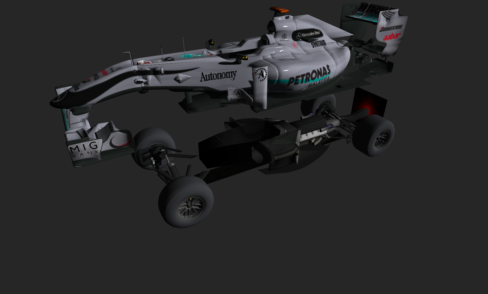

Authors - Mikhail Sorokin and Ruoyu Lei

Programming Assignment 4: Materials, Texture, and Transformations
----------
#### The following methods are implemented:

1. [Camera Parameter Animations](#camera)
2. [Materials](#materials)
3. [Groups](#groups)
4. [BONUS](#bonus)

# Camera

There are four parts of this:

- FOV Animation. Incrementing the field of view makes all objects appear smaller, while decreasing it makes the objects appear bigger.

- Near Plane. Increasing the near plane makes the objects disappear from the front, while decreasing it makes objects appear.

- Far Plane. Increasing the near plane makes the objects disappear from the back, while decreasing it makes objects appear from the back.

- Animate Camera. 

# Materials

- Cycle through each material. 
We mofified paintGL() to only draw one material at a time.

To use this function, keep right clicking "cycle material" to iterate all materials. Notice that the first material "default" won't show anything because it's blank. You will start seeing actual meshes starting from the second material.

- Animate the selected material. 
This function iterates through every material and move them up and back down. It's implemented by translating using a 3D vector, which is (0,0,z). X and Y remains the same all the time and we change z to move it along the z axis.

To use this function, you only need to right click "animate material" onces and each material will move up and down. This function finishes when all 8 materials have been iterated.

# Groups

- Cycle each group.
This function iterate all groups of objects and only draw the selected group and its name in the message box at a time. You have to keep right click "cycle group" to iterate all of them. NOTICE: to save time, we set key "7" to be the shortcut of this function, so you can keep pressing 7 to call this function and enter to omit the message box.

- Animate wheels

# BONUS

